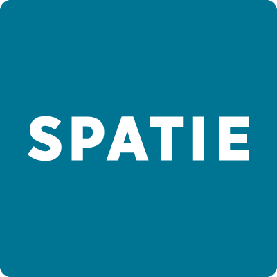
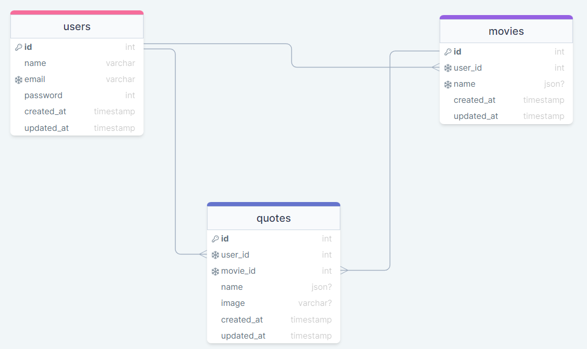

<div style="display:flex; align-items: center">
  <h1 style="position:relative; top: -6px" >Movie Quotes App</h1>
</div>

---
Movie Quotes is an App where you are able to see random movie quotes.
The platform has its own admin panel where you can add movies and quotes.

#
### Table of Contents
* [Prerequisites](#prerequisites)
* [Tech Stack](#tech-stack)
* [Getting Started](#getting-started)
* [Migrations](#migration)
* [Development](#development)
* [Resources](#resources)

#
### Prerequisites

*  *PHP@8.1 and up*
*  *MYSQL@8 and up*
*  *npm@7 and up*
*  *composer@2.4 and up*


#
### Tech Stack

*  [Laravel@9.x](https://laravel.com/docs/9.x) - back-end framework
*  [Spatie Translatable](https://github.com/spatie/laravel-translatable) - package for translation
*  [Tailwind CSS](https://tailwindcss.com) - CSS library

#
### Getting Started
1\. First of all you need to clone Movie Quotes repository from github:
```sh
git clone https://github.com/RedberryInternship/guram-tsagareishvili-movie-quotes
```

2\. Next step requires you to run *composer install* in order to install all the dependencies.
```sh
composer install
```

3\. after you have installed all the PHP dependencies, it's time to install all the JS dependencies:
```sh
npm install
```
4\. We need to link our storage folder to public folder:
```sh
php artisan storage:link
```
5\. Now we need to set our env file. Go to the root of your project and execute this command:
```sh
cp .env.example .env
```
6\. Next we need to generate Laravel key:
```sh
php artisan key:generate
```
And now you should provide **.env** file all the necessary environment variables:

#
**MYSQL:**
>DB_CONNECTION=mysql

>DB_HOST=127.0.0.1

>DB_PORT=3306

>DB_DATABASE=*****

>DB_USERNAME=*****

>DB_PASSWORD=*****

##### Now, you should be good to go!


#
### Migration
if you've completed getting started section, then migrating database if fairly simple process, just execute:
```sh
php artisan migrate
```

#
### Development

You can run Laravel's built-in development server by executing:

```sh
  php artisan serve
```

For Tailiwind CSS to work you must also run:

```sh
  npm run dev
```

#
### Resources

1\. Database structure in DrawSQL:
```sh
https://drawsql.app/teams/skeleton-team/diagrams/movie-quotes
```
